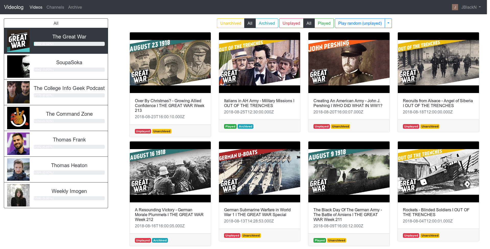
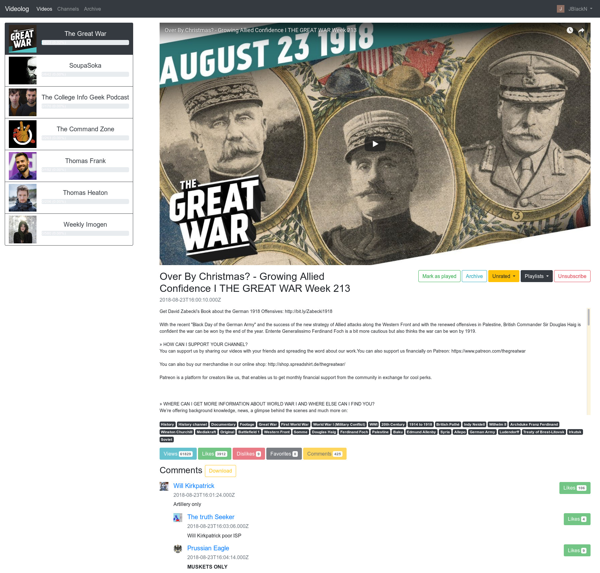
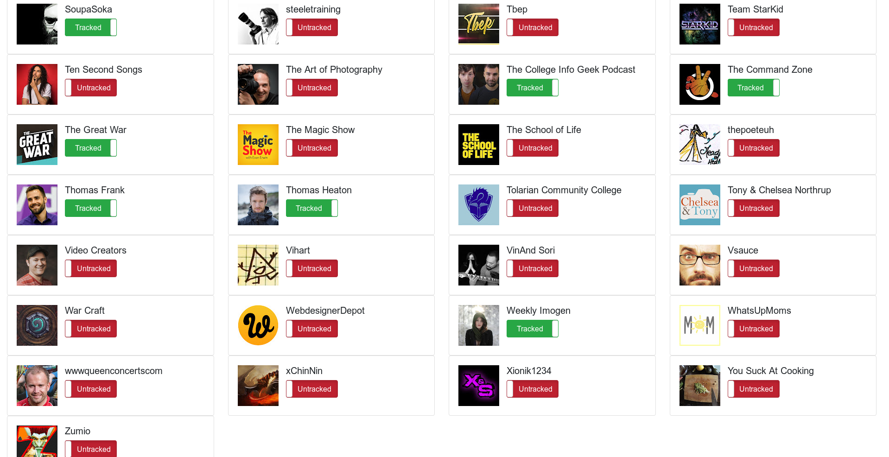
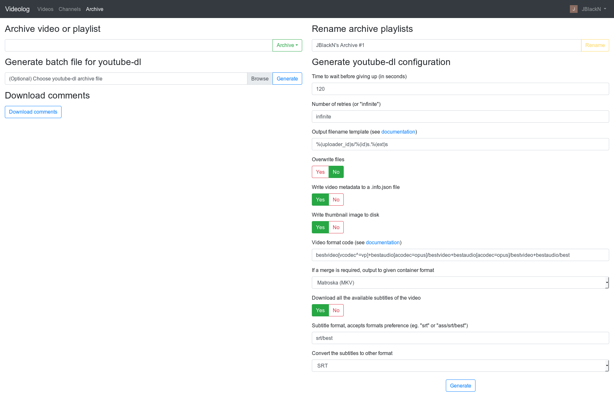

Videolog
========

Web application for YouTube_ channel watch progress tracking. Is also able to
generate input files and settings for youtube-dl_ and to download YouTube_
video comments.

.. _youtube-dl: https://rg3.github.io/youtube-dl/

|

|

|

|

Installation
------------

.. code-block:: bash

   python setup.py install

Client secret
-------------

**!!! IMPORTANT !!!**

Application uses YouTube_ Data API with OAuth 2.0, therefore client secret file
is needed. See guide_ how to obtain it. Place it in application's root directory
(client_secret.json).

.. _guide: https://developers.google.com/youtube/v3/quickstart/python#step_1_turn_on_the_api_name

Usage
-----

.. code-block:: bash

   python -m videolog run

or

.. code-block:: bash

   videolog run

Testing
-------

.. code-block:: bash

   pip install -r requirements.txt

.. code-block:: bash

   python setup.py test

Documentation
-------------

.. code-block:: bash

   pip install -r requirements.txt

.. code-block:: bash

   cd docs && make html && cd ..
   xdg-open docs/_build/html/index.html

License
-------

This project is licensed under the MIT License - see the
`LICENSE <../../../LICENSE>`_ file for more details.

.. _YouTube: https://www.youtube.com/
